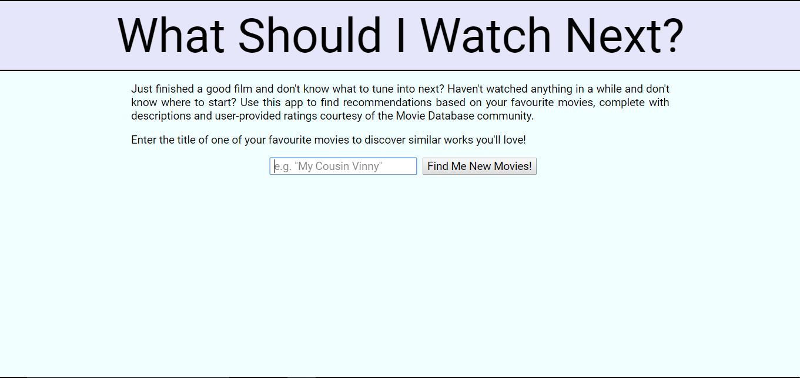
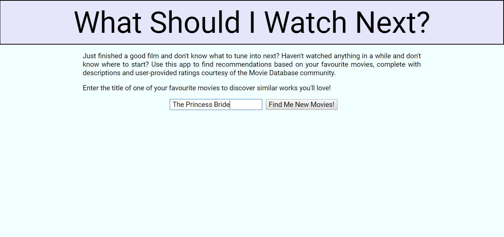
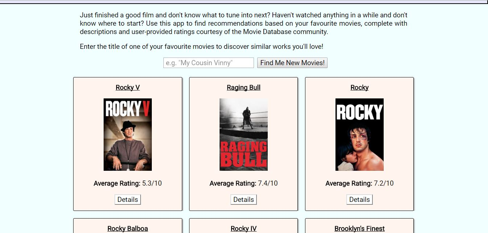
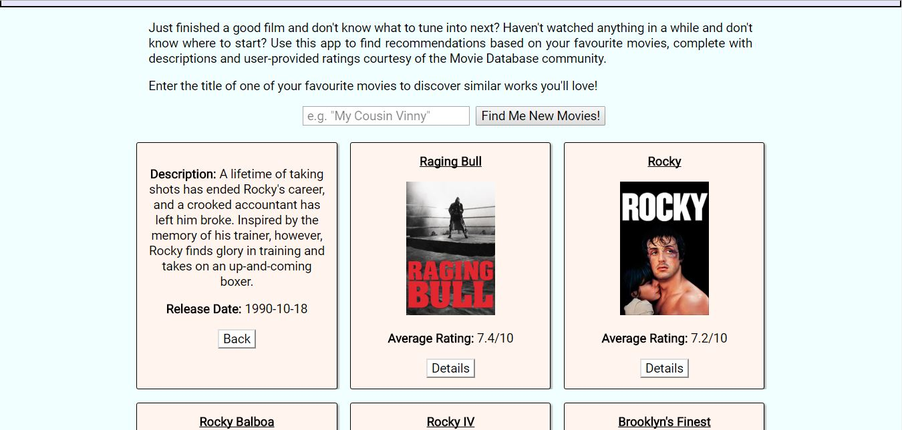

This application is my final capstone for the Thinkful Front-end Web Development course. It provides users with movie recommendations based on a movie title they enter.

Summary:
A user will enter the title of one of their favourite movies in the search bar. After clicking the button labeled "Find Me New Movies!", they will be presented with a series of recommendations. Each recommendation is listed on a card that displays the film title, promotion poster, and average user rating on the Movie Database. Clicking the button labelled "Details" will change the card's display to now include the film's description and release date.

The information used for this application is gathered via the Movie Database API.

Technology Used:
- HTML/CSS
- JavaScript
- jQuery
